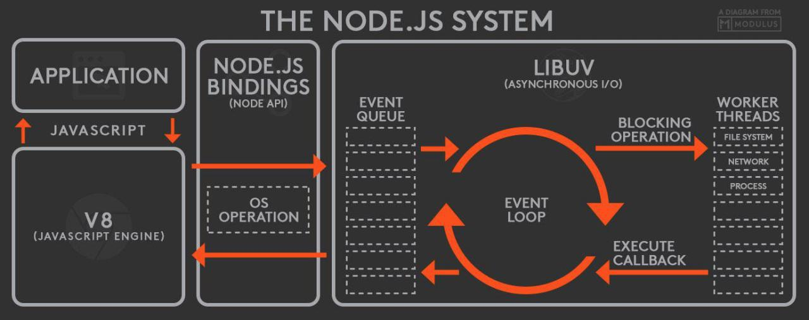
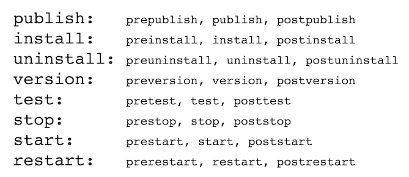

% Node Tech Plus 2019
% Maksym Tarasenko
% 6 Feburary 2019

# NODE.JS

## WHAT IS NODE?

* v8 javascript engine
* Event drivin
* Non-blocking standart libraries
* C \ C++ addons
* NPM

## nodejs system



## Modules

* Prevents pollution of the global scope
* Module structure
* module.exports
* Caching

## Modules: types

- js
- node
- json

## Modules: require

``` javascript
var module1 = require('module1');
var module1 = require('./node_modules/module1/index.js');
var module2 = require('./module2');
var module3 = require('../module3');
```

## Modules: exports

``` javascript
exports.log = function(msg) {
    console.log(msg);
}

module.exports = function Loger() {
    this.log = function(msg) {
        console.log(msg);
    }
};
```

## structure of "module" object

``` JSON
{
	"id": "The identifier for the module. Typically this is the fully resolved filename.",
	"exports": "Public interface of the module",
	"parent": "The module that first required this one.",
	"filename": "The fully resolved filename to the module.",
	"loaded": "Whether or not the module is done loading, or is in the process of loading.",
	"children": "The module objects required by this one."
}
```

# [NPM](https://www.npmjs.com) / [YARN](https://yarnpkg.com)

## NPM

* package.json
* npm init
* npm install
	* --save
	* --save-dev
	* --global 
* npm publish
* npm view (info)
* npm version

> list of global modules **npm ls -g --depth=0**

## package.json structure

```JSON
{
    "name": "name of package",
    "version": "version of package (major.minor.patch)",
    "description": "package description", 
    "main": "entry point (index.js as default)",
    "bin": "object with global registration names (PATH) and node module",
    "scripts": "dictionary containing script commands that are run at various times in the lifecycle of your package",
    "files": "array of files to include in your project",
    "keywords": "array of strings, using for search",
    "author": "package author",
    "license": "package license",
    "repository": "specify the place where your code lives",
    "bugs": "the url to your project's issue tracker.",
    "homepage": "the url to the project homepage.",
}
```

## lifecycle events



## EventEmitter/streams/pipe

* EventEmitter
* fs
* http
* [stream-adventure](https://github.com/workshopper/stream-adventure)

## EventEmitter

``` javascript
var EventEmitter = require('events');
var emitter = new EventEmitter();
var listener = (arg) => {console.log(arg);};
emitter.on('test', listener);
setTimeout(function() {
    emitter.emit('test', 'Hello world');
    emitter.removeListener('test', listener);
    emitter.emit('test', 'Hello world');
}, 1000);
```

## Readable Stream

``` javascript
var fs = require('fs');
var readableStream = fs.createReadStream('file.txt');
var data = '';
readableStream.on('data', function(chunk) {
    data+=chunk;
});
readableStream.on('end', function() {
    console.log(data);
});
```

## Writable Streams

``` javascript
var fs = require('fs');
var readableStream = fs.createReadStream('file1.txt');
var writableStream = fs.createWriteStream('file2.txt');
readableStream.on('data', function(chunk) {
    writableStream.write(chunk);
});
```

## duplex, transform streams

``` javascript
a.pipe(b).pipe(a)
a.pipe(b).pipe(c)
```

## Pipe

``` javascript
var writableModuleStream = fs.createWriteStream('module.txt');
var stream = fs.createReadStream('data.csv');
stream.on('readable', onFileRead);
stream.on('end', function() {
    writableModuleStream.end();
});

function onFileRead() {
    var data = stream.read();
    if (data && !writableModuleStream.write(data)) {
        stream.removeListener('readable', onFileRead);
        writableModuleStream.once('drain', function() {
            stream.on('readable', onFileRead);
            onFileRead();
        });
    }
```

## fs + http

``` javascript
var http = require('http'),
fs = require('fs');
http.createServer(function(request, response) {
    if (req.method === 'POST') {
        fs.readFile('./data.csv', 'utf-8', function(err, data) {
            response.end(data);
        });
    } else res.end('send me a POST\n');
}).listen(3000);
```

# ASYNC CODE

##

* Node-style
* Promises (Q)
* Async
* Generators(ES6)

## Node-style

``` javascript
var someModule = require('./some_module');
someModule.sum({ x: 1, y: 2 }, function(err, result) {
    if (err) {
        console.log(err);
        return;
    }
    console.log(result);
});
```

## Promises (Q)

``` javascript
var someModule = require('./some_module');
var qSum = Q.denodeify(someModule.sum);
Q({ x: 1, y: 2 })
    .then(qSum)
    .then(function(result) {
        console.log(result);
    })
    .catch(function(error) {
        console.log(error);
    });
```

## Async

``` javascript
var async = require('async');
var someModule = require('./some_module');
async.waterfall([
    function(callback) {
        callback(null, { x: 1, y: 2 });
    },
    someModule.sum,
    function(result, callback) {
        console.log(result);
    },
], function (err, result) {
    console.log(err);
});
```

## Generators

``` javascript
var Q = require('Q');
var co = require('co');
var someModule = require('./some_module');
var qSum = Q.denodeify(someModule.sum);
function* test() {
    try {
        var result = yield qSum({x: 1, y: 2});
        console.log(result);
    } catch(err) {
        console.log(err);
    }
};
co(test);
```

## async/await

``` javascript
function caserUpper(val) {
  return new Promise((resolve, reject) => {
    resolve(val.toUpperCase());
  });
}

async function msg(x) {
  try {
    const msg = await caserUpper(x);
    console.log(msg);
  } catch(err) {
    console.log('Ohh no:', err.message);
  }
}
```

# SETUP APPLICATION

##

* npm init
* lock files
* eslint
* prettier
* babel
* pre-commit
* lint-staged
* typescript
* dependency injection ([Inversify](http://inversify.io))
* config (dotenv)

# REST (Representational State Transfer)

## METHODS

Safity / Idempotency

| HTTP Method | Safe | Idempotent |
|:-----------:|:----:|:----------:|
| **GET**     | + | + |
| **PUT**     | - | + |
| **DELETE**  | - | + |
| **POST**    | - | - |
| **PATCH**   | - | - |

## RESPONSE STATUS CODES

* 1xx informational
* 2xx success
* 3xx redirect
* 4xx client error
* 5xx server error

## REST API IS COMPOSED OF

* docroot
* resource
* collection
* controller

## RESOURCES

	GET		/pet/{petId} (find pet by Id)
	PUT		/pet/{petId} (update an existing pet)
	DELETE	/pet/{petId} (delete a pet)
	POST	/pet/{petId}/uploadImage (upload an image)

## Examples

### FILTERING

	GET /comments?filter[post]=1,2&filter[author]=12 HTTP/1.1

### PAGINATION

	GET /articles?page[number]=3&page[size]=1 HTTP/1.1

## Values

* Uniform Interface
* Stateless Interactions
* Cacheable
* Client-Server
* Layered System
* Code on Demand

## GOLDEN RULES

* Flat is better than nested
* Simple is better than complex
* Strings are better than numbers
* Consistency is better than customization

# GraphQL

# EXPRESS

## BASICS

* Middleware concept
* Configuration of express
* Request
* Response

## Middleware concept

``` javascript
var express = require('express');
var app = express();
app.use(bodyParser.json());
app.use(function (req, res, next) {
    console.log('Time:', Date.now());
    next();
});
app.get('/user', function(req, res) {
    res.send('hello user');
});
app.listen(3000, function () {
    console.log('Example app listening on port 3000!');
});
```

## ROUTING

* Respond to HTTP requests with a callback
* Supports variable placement in routes
* Easy to serve JSON
* Routing filter types

``` javascript
app.get('/', function (req, res) {});
app.post('/:id', function (req, res) {});

var express = require('express');
var router = express.Router();
router.put(/\/abc|\/xyz/, function (req, res) {}});
router.delete(['/', '/:id'], function (req, res) {});
```

## Templating

``` javascript
app.set('view engine', 'ejs');
app.locals.title = 'My App';
app.get('/', function (req, res) {
    res.locals.someText = 'test';
    res.render('test', { message: 'Hello there!'});;
});
```

# DEVELOPMENT

##

* postman
* [winston](https://github.com/winstonjs/winston)
* [nodemon](https://www.npmjs.com/package/nodemon)
* [inspect](https://nodejs.org/en/docs/guides/debugging-getting-started/)
* Debugging (--inspect    --inspect-brk)
* Cluster
  * > UV_THREADPOOL_SIZE
* [pm2](http://pm2.keymetrics.io)
  * pm2 start * --watch
  * pm2 list 
  * pm2 monit
  * pm2 stop all

# Error Handling

##

* Exceptions
* [Async/await node express](https://www.npmjs.com/package/express-async-errors)

``` javascript
const express = require('express');
require('express-async-errors');
const User = require('./models/user');
const app = express();
 
app.get('/users', async (req, res) => {
  const users = await User.findAll();
  res.send(users);
});
```

# SECURITY

##

* root
* eval is EVIL
* HTTPS
* CORS
* CSP
* Do not trust anyone
* HTTP Headers ([helmetjs](https://helmetjs.github.io))

## SECURITY TOOLS

* [Node.js Security Checklist](https://blog.risingstack.com/node-js-security-checklist/)
* nodesecurity
* [snyk](https://snyk.io)
* [retire.js](https://retirejs.github.io/retire.js/)

# DB Overview

* SQL (ORM Sequelize)
* mongo (mongoose)
* redis

# Questions?

## Links

* [BE with NestJs](https://auth0.com/blog/full-stack-typescript-apps-part-1-developing-backend-apis-with-nestjs/)
* [The Twelve Factors](https://12factor.net/)


## Notes

> ab -c 50 -n 500 localhost:3000/fast
